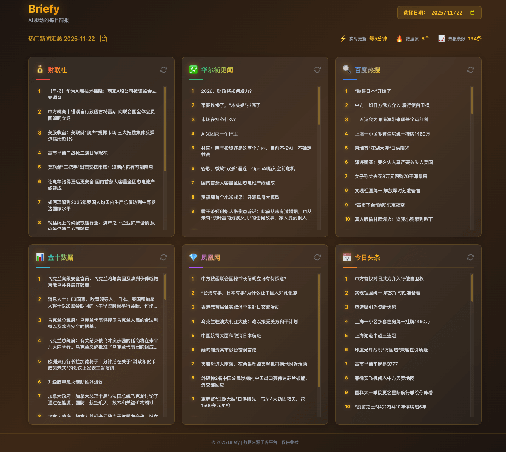

# Briefy

[](https://opensource.org/licenses/MIT)

> Your daily brief, powered by AI  
> AI 驱动的每日简报 - 热点·摘要·播报

## What is Briefy?

A lightweight AI tool that briefs you on trending topics:

- 🔥 Multi-platform hot topics (Baidu, Toutiao, Ifeng, Jin10, Cailian Press, WallstreetCN)
- 🤖 AI-generated concise summaries
- 🎙️ Text-to-speech audio briefings
- ⚡ Fast, clean, mobile-friendly

**5 分钟掌握全网热点。**



## Features

- Real-time aggregation from multiple news sources
- Visual dashboard with trending topics
- AI-powered smart summarization
- Text-to-speech audio briefings
- Audio playback in web interface
- Responsive design
- Lightweight & fast

## Quick Start

Make sure you have [uv](https://docs.astral.sh/uv/getting-started/installation/) installed.

```bash
# Install dependencies
uv sync

# Run the service
uv run main.py
```

Visit http://127.0.0.1:8000 to view the dashboard.

### AI Summary

Edit the `.env` file in the project root to enable AI summary generation:

```bash
# Enable AI summary generation (set to 1 to enable)
ENABLE_SUMMARY=1

# Reader API configuration
READER_API_KEY=your_reader_api_key

# LLM configuration
LLM_API_KEY=your_llm_api_key
LLM_MODEL=openai/glm-4.5-flash
LLM_API_BASE=https://open.bigmodel.cn/api/paas/v4/

# Other model examples:
# OpenAI: LLM_MODEL=gpt-4o-mini, LLM_API_KEY=sk-xxx, LLM_API_BASE=https://api.openai.com/v1/
# DeepSeek: LLM_MODEL=deepseek/deepseek-chat, LLM_API_KEY=sk-xxx, LLM_API_BASE=https://api.deepseek.com/
```

**Note**: Unless `ENABLE_SUMMARY=1` is set, the service will only fetch and aggregate news without generating summaries.

## Current Data Sources

- 百度热搜 (Baidu)
- 今日头条 (Toutiao)
- 凤凰网 (Ifeng)
- 金十数据 (Jin10)
- 财联社 (Cailian Press)
- 华尔街见闻 (WallstreetCN)

## Planned

- **Performance Optimization**: Parallel processing for summary generation to improve efficiency
- **Data Analysis**: Keyword monitoring, historical trend analysis (topic lifecycle, popularity changes, cross-platform comparison, etc.)
- **Data Storage**: Consider migrating to database storage for complex queries if needed
- **Personalized Recommendation**: User preference learning system - mark interested/uninterested news types (e.g., military, tech, entertainment), AI learns your preferences and recommends/presents only relevant content daily

## License

This project is licensed under the MIT License - see the [LICENSE](LICENSE) file for details.

本项目采用 [MIT 许可证](LICENSE)。

## Disclaimer

This project is for educational and research purposes only. You must comply with applicable terms of service and robots.txt rules. If commercial use impacts target websites, violates their policies, or triggers legal disputes, all consequences shall be borne by you. The author bears no responsibility.

本项目仅用于学习和研究目的，请遵守相关条款和 robots.txt 规则。若商业化使用对目标网站造成影响、违反其政策或引发法律纠纷，所有后果由使用者自行承担，与作者无关。
